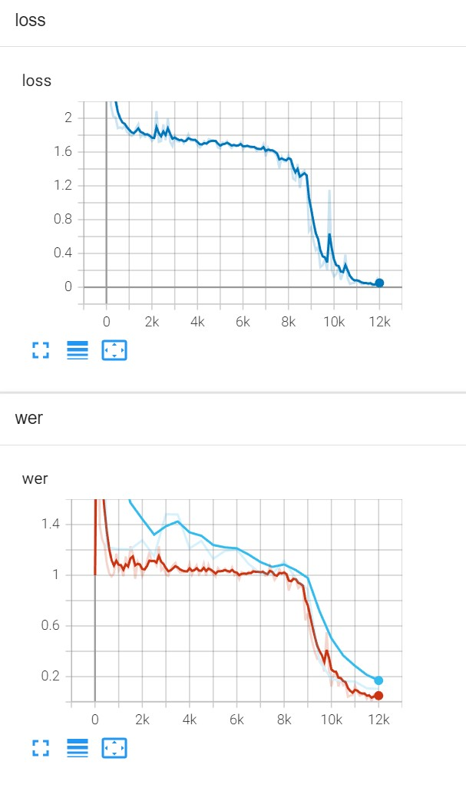
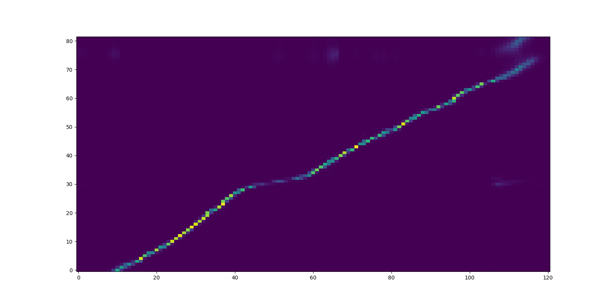

# HW1——语音识别

该项目完成了李宏毅老师语音识别的作业1，将单语者中文语音转为注音符号。

> 课程主页：[Hung-yi Lee (ntu.edu.tw)](http://speech.ee.ntu.edu.tw/~tlkagk/courses_DLHLP20.html)
>
> HW1视频介绍：[DLHLP HW1 - YouTube](https://www.youtube.com/watch?v=VWSihdQTTmg)
>
> 原project链接：[Alexander-H-Liu/End-to-end-ASR-Pytorch](https://github.com/Alexander-H-Liu/End-to-end-ASR-Pytorch)


## 准备

### TODO: Prepare vocab-count file

在命令行输入

```
python util/generate_vocab_file.py 
--input_file <input_text_file> 
--mode character 
--output_file <output_vocab_file>

```

## 训练

### 训练

修改main函数运行配置为

```
--config config/dlhlp/asr_dlhlp.yaml
```


### 使用tensorboard观测训练过程

```
tensorboard --logdir log/ 
```

默认端口号： http://localhost:6006/

### 出现的问题

1. **多线程报错** :  RuntimeError: Tried to serialize object\_\_torch\_\_.src.audio.Delta which does not have a \_\_getstate\_\_ method defined!

   暂时改成单线程凑合着用

2. CTC和LAS混合训练时初始梯度为NAN：

   目前的解决方案是只训练LAS;

   建议参考项目文档的方案改一下再试试

3. pytorch env下的tensorboard不可以，诊断后提示下载tensorflow: 使用tensorflow2.3.1 env打开tensorflow即可


## 验证

修改main函数运行配置为

```
--config config/dlhlp/decode_dlhlp.yaml --test
```

decode.py 114 work

## 评估结果

仅使用LAS采用8k样本训练12000轮, beam_size = 2的结果

```
python3 eval.py --file result/decode_dlhlp_test_output.csv


============  Result of result/decode_dlhlp_dev_output.csv ============
 -----------------------------------------------------------------------
| Statics		|  Truth	|  Prediction	| Abs. Diff.	|
 -----------------------------------------------------------------------
| Avg. # of chars	|  82.18	|  81.96	|  0.68		|
| Avg. # of words	|  17.14	|  17.11	|  0.04		|
 -----------------------------------------------------------------------
 ---------------------------------------------------------------
| Error Rate (%)| Mean		| Std.		| Min./Max.	|
 ---------------------------------------------------------------
| Character	| 2.8230	| 2.71		| 0.00/22.73	|
| Word		| 9.1895	| 7.92		| 0.00/50.00	|
 ---------------------------------------------------------------
Note : If the text unit is phoneme, WER = PER and CER is meaningless.
```

训练过程曲线和attention权重可视化见下图：





## 问题

1. 在windows系统下使用多线程 出现报错 `RuntimeError: Tried to serialize object__torch__.src.audio.Delta which does not have a __getstate__ method defined!`的问题仍待解决...
2. 由于时间问题，加上多线程加载报错，我没有训练LM，LM的训练方式可参见课程相关资源；此外最开始我尝试LAS和CTC的联合训练但初始梯度即为NAN，项目原作者也提到了这一现象并在readme中给出了解决方案。

## 其他

1. 详细的了解本项目的工作原理需要阅读[Alexander-H-Liu/End-to-end-ASR-Pytorch](https://github.com/Alexander-H-Liu/End-to-end-ASR-Pytorch)中提到的几篇论文，特别是[Joint CTC-Attention based End-to-End Speech Recognition using Multi-task Learning](https://arxiv.org/abs/1609.06773), S Kim *et al.* 
2. 提供一个注音符号转拼音网址，用于观察翻译结果：[中文转注音和注音转拼音工具 (chineseconverter.com)](https://www.chineseconverter.com/zh-cn/convert/zhuyin)

